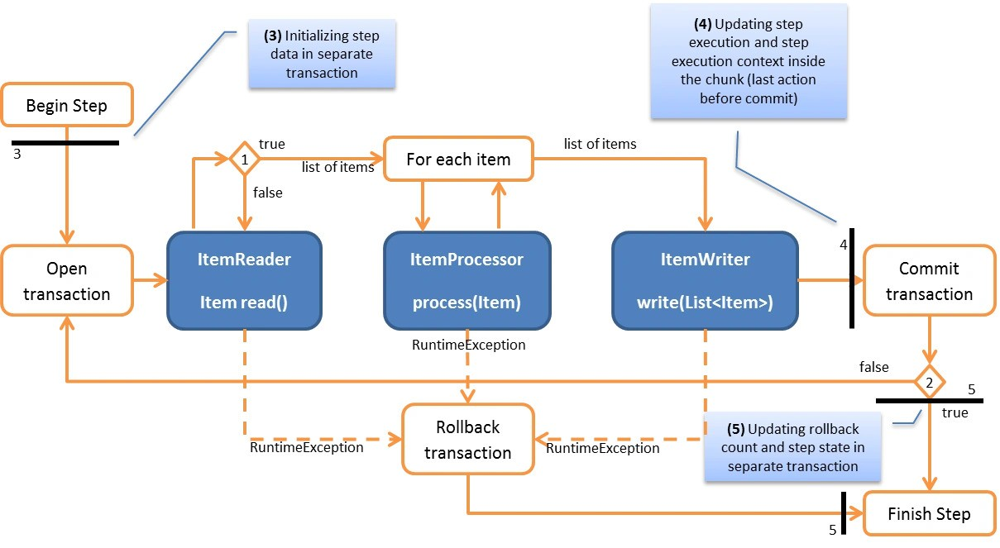
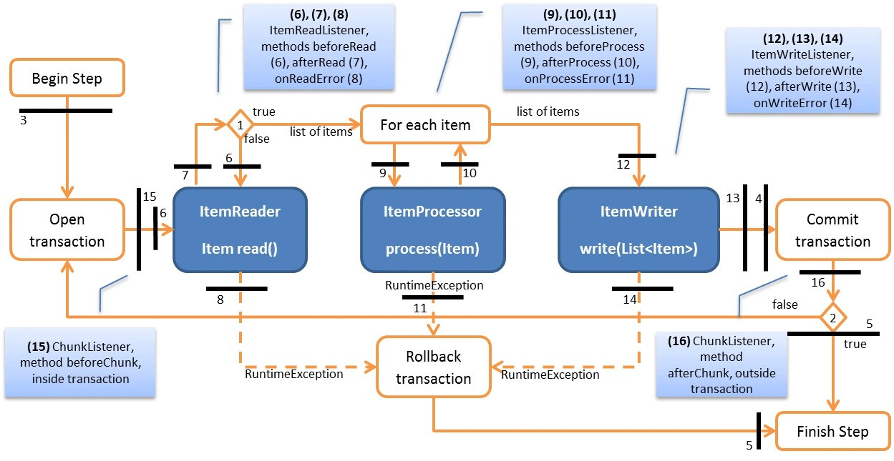
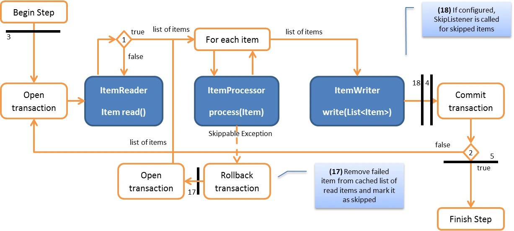

# Introduction
This aims to help with understanding the more complex parts of spring-batch processing, such as chunk-oriented processing, transaction management and fault tolerance, as well as to document some risks.

## Chunk processing
Chunk oriented processing refers to reading the data one at a time and creating 'chunks' that are written out within a transaction boundary. Once the number of items read equals the commit interval, the entire chunk is written out by the ItemWriter, and then the transaction is committed.

As spring batch stores metadata like count and state of the step, these are also done at the same transaction if there are no exceptions thrown requiring a rollback (assuming not fault-tolerant and no skip configured).
The following diagram shows what happens in a transaction boundary

## Listeners 
We can use listeners to add processing logic when certain events are fired. However, we need to take note of when the events are fired, and whether it is done in the same transaction boundary

| Behaviour                                                                                                       | Risk                                                                                                              | Best Practices                                                            |
|-----------------------------------------------------------------------------------------------------------------|-------------------------------------------------------------------------------------------------------------------|---------------------------------------------------------------------------|
| Listener (Reader, Processor, Writer)  onXXXError methods are executed right before rolling back the transaction | If we were to interact with a transactional resource in a listener error method, the changes might be rolled back | Not use listener error callback, else to open a new transaction ourselves |
|                                                                                                                 |                                                                                                                   |                                                                           |

## Skip mechanism

We are able to declare a step as fault tolerant and configure particular exceptions to be skipable or retryable given a policy. This will reduce the case of the step terminating upon an exception, as stated above.

Since the interactions are more complex, a walkthrough of a chunk of items processed is as such:

1. Item is read (cursor or paginated) into a Chunk - FaultTolerantChunkProcessor
2. Item is processed in the chunk
3. A problematic item throws a skippable exception in the processor
4. Transaction is rolled back and problemmatic item is removed from the chunk
5. A new transaction is opened, and chunk scanning is triggered. Chunk scanning is when commit-interval is set as 1, and we iterate through the items 1 by 1 in the chunk to retry (refer to [sample](https://github.com/spring-projects/spring-batch/tree/main/spring-batch-samples#chunk-scanning-sample)). Retry mechanism is done via spring-retry (`RetryTemplate`), further described below
6.  SkipListener is always called just before the transaction is committed.
   - Spring batch design to ensure that any transactional resources call by the listener are not rolled back by a failure within the ItemWriter.

## Retry mechanism via spring-retry
Retry mechanism is done via [spring-retry](https://github.com/spring-projects/spring-retry), where a `RetryOperator` takes in retry and/or recovery callbacks.
In this case, we are doing  stateful retry (defined by spring-retry as it caused a transactional resource to become invalid). Underlying it uses a cache (`RetryContextCache`) since it has to rethrow the exception for the database to be rolled back, and the cache helps us to continue on with the retry, and to recognize the states across different invocations.

As stated in the documentations:
> Warning: Be very careful with the implementation of Object.equals() and Object.hashCode() in the key returned by RetryState. The best advice is to use a business key to identify the items. In the case of a JMS message, you can use the message ID.

| Behaviour                                                                                                                                                                                          | Risk                                                                                                                                                                                                                                                                                                                 | Best Practices                                                                                                                                                                                                                                                                                                |
|----------------------------------------------------------------------------------------------------------------------------------------------------------------------------------------------------|----------------------------------------------------------------------------------------------------------------------------------------------------------------------------------------------------------------------------------------------------------------------------------------------------------------------|---------------------------------------------------------------------------------------------------------------------------------------------------------------------------------------------------------------------------------------------------------------------------------------------------------------|
| Skip mechanism involves doing a chunk scanning and does a retry on each item.                                                                                                                      | Design of item processor may result in inconsistent results.                                                                                                                                                                                                                                                         | Documentation clearly mentions that in a fault-tolerant step, the item processor should be designed in an idempotent way or marked as non transactional with the processorNonTransactional flag (which will re-use processed items from the cache between retries).                                           |
| Skip mechanism involves doing a chunk scanning and does a retry on each item.                                                                                                                      | Performance: This feature is quite "naive" and performs poorly, assuming chunk size of 1000, there will be 1 (original) + 1000 transactions.                                                                                                                                                                         | While there are some discussions on how to optimise (e.g., binary chunk scanning) in the library, these are not actively worked on. One way we can optimise, if we have made the processor non-transactional, is to use the `processorNonTransactional` which will save the costs of "re-processing" the item |
| Skip mechanism involves doing a chunk scanning and does a retry on each item. Underlying it uses a cache, whose key is the item (`RetryState.key`)                                                 | If we do not override equals anad hashCode, it will affect the retry mechanism, and it will cause false failure exceptions                                                                                                                                                                                           | Override object equals and hashcode                                                                                                                                                                                                                                                                           |
| Skip mechanism involves doing a chunk scanning and does a retry on each item. Underlying it uses a cache, and the default implementation of the RetryContextCache is in-memory, using a simple Map | Map has strictly enforced maximum capacity, to avoid memory leaks, but it does not have any advanced cache features (such as time to live). May not suit advanced usage with multiple processes in a clustered environment                                                                                           | To consider clustered cache for more advanced use cases                                                                                                                                                                                                                                                       |
| Skip mechanism involves doing a chunk scanning and does a retry on each item by rescoping the transaction around each item                                                                         | Transactional readers (`JmsItemReader`) are unable to scope transactions for each item. As long as one of the items in a chunk fails with a skippable exception during write, all items in the chunk get skipped - [Spring batch issue 1716](https://github.com/spring-projects/spring-batch/issues/1716)            | Spring batch does not support this use-case since transactional readers are rare                                                                                                                                                                                                                              |
| Chunk processing is complex (especially with repeat/retry/transaction callbacks), and the concurrency approach presents some risks.                                                                | This results in several issues like maxItemCount not being honored in a multi-threaded step, inconsistent state when a transaction is rolled-back leading to optimistic locking issues, throttling issues, poor performance - [Spring batch issue 3950](https://github.com/spring-projects/spring-batch/issues/3950) | Take note of the risks if using a multi-threaded step                                                                                                                                                                                                                                                         |

## Common misunderstandings

1. Page size vs Chunk size
  - Page size: page size of the reader controls how many items are fetched per query from the DB,
  - Chunk size: chunk size controls how many items are passed to the Writer in one invocation of its write method, also known as commit-interval

## Other risks
1. Confusing/Lack of documentations
  - Especially on the different configurations aad expected behaviour of fault tolerant steps [Spring batch issue 3748](https://github.com/spring-projects/spring-batch/issues/3748)

## Resources
[Transaction](https://www.codecentric.de/wissens-hub/blog/transactions-in-spring-batch-part-2-restart-cursor-based-reading-and-listeners)
[Skip and Retry](https://www.codecentric.de/wissens-hub/blog/transactions-in-spring-batch-part-3-skip-and-retry)

